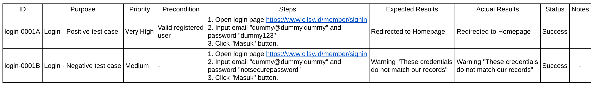

# Guideline Test Case QA

Test Case adalah seperangkat kondisi yang digunakan untuk memvalidasi bahwa software yang dikembangkan dapat berfungsi sesuai dengan requirements-nya, baik dari segi fitur maupun fungsionalitas dari software yang dikembangkan. Secara garis besar, pengujian ini meliputi pre-kondisi, expected results, dan post-kondisi.

## Positive, Negative, and Destructive Test Case

1. Positive Case: memasukkan input yang valid untuk memverifikasi bahwa fitur software melakukan apa yang seharusnya dilakukan. Contoh dari positive case adalah jika bidang kata sandi harus menerima sepuluh karakter, pengguna dapat membuat kata sandi tersebut.
2. Negative Case: memasukkan input yang tidak valid dan memverifikasi bahwa fitur software melakukan apa yang seharusnya tidak dilakukan. Contoh dari case ini ialah pengguna tidak dapat membuat kata sandi lebih dari sepuluh karakter.
3. Destructive Case: pembuatan test case ini bertujuan untuk mengetahui beban yang dapat ditangani oleh sistem sampai sistem itu rusak atau “destructive”. Contoh dari case destructive ini ialah menekan dengan cepat untuk memecahkan halaman web.

## Main Attribute Test Case

Umumnya, tidak ada template formal yang bisa digunakan untuk membuat Test Case, namun terdapat poin-poin penting yang perlu kita masukkan dalam pembuatan Test Case ini. Adapun poin tersebut ialah:

- Unique Identification Number (ID): bisa berupa angka atau gabungan antara angka dan huruf
- Purpose: fitur yang akan diuji
- Priority: menunjukan tes apa yang lebih mendesak untuk dilakukan
- Preconditions: daftar tindakan yang harus dilakukan sebelum menjalankan kasus uji
- Steps: langkah-langkah yang dilakukan saat pengujian
- Expected Results: hasil yang diharapkan sebelum melakukan pengujian
- Actual Results: hasil yang didapatkan setelah pengujian
- Status: succes, failed, blocked.
- Notes: info tambahan

## Characteristic of a Good Test Case

Pembuatan test case harus menghindari penjelasan yang tidak jelas tentang langkah-langkah atau hasilnya, oleh karena itu pembuatan test case ini dibuat se-efisien mungkin (tidak kekurangan informasi maupun kelebihan). Karakteristik test case yang baik ialah:

- Accurate: sesuai dengan tujuan pengujian
- Simple: sederhana dan mudah dimengerti tanpa langkah yang rumit
- Traceable: mudah dilacak ke persyaratan yang diuji
- Repeatable: dapat diuji berulang kali dengan berbagi input
- Maintainable: mudah dimodifikasi (jika ada perubahan)

## Tips for Writing Effective Test Case

1. Gunakan judul yang kuat dan mudah dipahami.
2. Perhatikan langkah-langkah dan pra-syaratnya.
3. Test case mencakup satu fungsi dan satu expected results.
4. Tulis langkah-langkah yang dirancang dengan baik dan mudah dimengerti.
5. Tambahkan informasi yang berguna di kolom komentar.
6. Mulai berlatih.

## Stage of Test Case

### 1. Unit Test

Tes unit merupakan sebuah tes yang memastikan bahwa setiap code yang dibuat (metode, prosedur, kelas, dan lain-lain) sudah berjalan dengan benar. Ketika melakukan tes unit ini, pisahkan unit yang diuji dengan unit yang lain agar kesalahan yang mungkin terjadi pada unit lain tidak akan mempengaruhi unit yang diuji.

Dengan menggunakan situasi ini, pengujian unit dijalankan, dan hasilnya dibandingkan dengan hasil yang diharapkan untuk memutuskan apakah pengujian berhasil atau tidak. Berikut merupakan contoh tes unit:

Misalnya terdapat metode isitPositive (int k). Dalam metode ini, jika variabel bilangan bulat k negatif, maka hasilnya benar, namun sebaliknya, jika variabel bilangan bulat positif, maka hasil yang dikeluarkan salah.

Sekarang kita mencoba untuk melakukan testing unit dengan cara memasukkan nilai k sebagai bilangan kurang dari 0 (negatif) dan bilangan lebih dari 0 (positif):

### 2. Integration Test

Setelah berhasil menjalankan tes unit, langkah selanjutnya yang dapat dilakukan adalah tes integrasi. Tes integrasi ini bertujuan untuk memverifikasi bahwa komponen dalam software terintegrasi satu sama lain dan dapat bekerja secara harmonis. Saat melakukan tes, gunakanlah parameter yang sama, kemudian hasilnya dibandingkan dengan nilai yang diharapkan untuk memverifikasi bahwa sistem melakukan perilaku yang diharapkan.

Untuk melakukan tes integrasi, terdapat beberapa strategi yang dapat digunakan seperti:

1. Big Bang Strategy

Langkah pertama yang dilakukan dalam strategi ini adalah mengintegrasikan seluruh modul yang ada, baik modul tingkat tinggi maupun tingkat rendah, setelah melakukan integrasi antar modul tersebut, maka langkah selanjutnya adalah pengujian yang melibatkan sistem secara keseluruhan.

Dalam strategi ini, karena pengujian melibatkan sistem secara keseluruhan, pelaksanaan strategy ini dapat dilakukan dengan cepat dan menghemat waktu. Namun, sulit untuk menentukan di lapisan level mana atau dari modul mana kesalahan terjadi.

1. Bottom-up Strategy

Pertama-tama, strategy bottom-up dimulai dengan menyelesaikan tes unit. Setelah semua unit terintegrasi satu sama lain, tes integrasi dilakukan pada modul tingkat rendah. Setelah berhasil menyelesaikan tes ini, sistem modul lapisan atas terintegrasi. Integrasi ini berlanjut hingga seluruh sistem dibangun dan pengujian integrasi berhasil diselesaikan.

1. Top-down Strategy

Strategi pengujian integrasi top-down dimulai dengan menguji modul atas (modul terluar, biasanya modul GUI pengguna) untuk sistem. Modul ini menggunakan stub dari submodul yang diperlukan.

Jumlah kasus uji yang berjalan mencapai tingkat tertentu atau lulus semuanya menunjukkan pengujian integrasi yang selesai. QA engineer harus melaporkan kesalahan yang ditemukan pada tahap ini kepada software developer sesuai dengan mekanisme pelaporan kesalahan yang ditentukan.

### 3. System Test

Tes sistem ini fokus untuk mengevaluasi fitur perangkat lunak yang dikembangkan termasuk kinerja, keandalan, dan fungsionalitas. Namun hal tersebut harus memastikan bahwa software yang dikembangkan telah melewati tahap tes unit dan tes integrasi. Tes sistem ini bertujuan untuk memverifikasi apa yang diinginkan user dari sistem serta skenario yang dibuat harus sesuai dengan system requirements.

Langkah pertama dari pengujian sistem ini adalah memverifikasi persyaratan fungsional yang dilakukan. Sebagai hasil dari verifikasi ini, QA engineer dapat melihat bahwa sistem bekerja secara fungsional. Setelah memverifikasi fungsionalitas, langkah selanjutnya adalah memverifikasi-nya secara non-fungsionalitas. Adapun hal-hal yang perlu diperhatikan saat tes non-fungsionalitasi ialah sebagai berikut:

- **Stress Test:** tes ini fokus untuk menguji sistem ketika laju input ke sistem melebihi laju desain sistem.
- **Performance Test: t**es ini mengevaluasi apakah keluaran sistem dapat diproduksi dalam kerangka waktu yang ditentukan dan dapat diterima.
- **Configuration and Compatibility Test:** pengujian ini mengevaluasi bagaimana sistem yang dikembangkan berperilaku pada platform dan perangkat keras yang berbeda.
- **Security Test:** tes ini mengevaluasi perilaku sistem dalam upaya penggunaan yang tidak sah dan keamanan sistem.
- **Usability Test:** tes ini mengevaluasi interaksi sistem pengguna dan tingkat ergonomi pada sistem.
- **Rollback Test:** tes ini mengevaluasi pemulihan otomatis atau manual sistem jika terjadi kegagalan.
- **User Interface Test:** tes ini mengevaluasi bagaimana pengguna dan perangkat lunak akan berinteraksi sebagai representasi grafis, dan bagaimana sistem akan memproses input yang akan diberikan pengguna ke sistem dengan keyboard, layar, atau mouse

Sistem yang telah menyelesaikan pengujian nonfungsionalnya sekarang siap untuk pengujian penerimaan pengguna. Kesalahan yang terjadi selama pengujian sistem dilaporkan sesuai dengan proses manajemen kesalahan proyek, dan koreksi yang diperlukan dilakukan. Setelah perbaikan yang diperlukan, sistem menjalani pengujian berulang untuk mengevaluasi bahwa perbaikan tersebut tidak memengaruhi sistem lainnya.

### 4. Acceptance Test

Tes Acceptance ini merupakan tes yang dilakukan untuk memvalidasi keinginan dari user. Dalam sistem yang dikembangkan, test case yang dilakukan sesuai dengan dokumen User Acceptance Test (UAT) plan, dan user yang akan menjalankan tes tersebut dari awal sampai selesai. Singkatnya, setelah seluruh sistem berhasil, maka pelanggan dapat menerima sistem secara utuh.